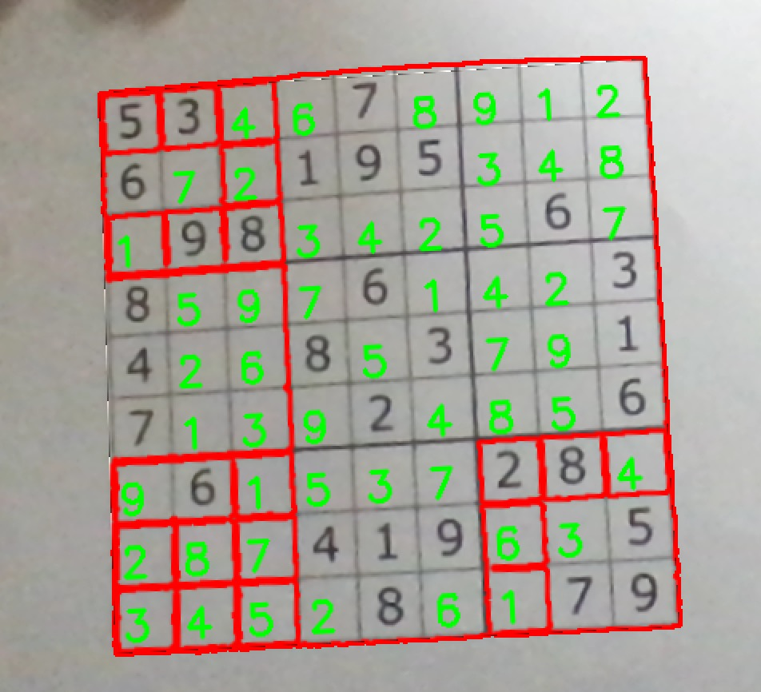

# Sudoku Solver #



## Description ##
An augmented reality Sudoku solver made with OpenCV, Python, and TensorFlow.

> Sudoku is a logic-based, combinatorial number-placement puzzle. In classic Sudoku, the objective is to fill a 9 × 9 grid with digits so that each column, each row, and each of the nine 3 × 3 subgrids that compose the grid contain all of the digits from 1 to 9.

The main motivation behind this project was to create a fast, easy-to-use application to automatically solve sudoku problems.

## Running ##
This project requires tensorflow, scikit-learn, and opencv.

Note: There is no need to build the project beforehand, as the digit recognition model is saved and does not need to be retrained. 
```
python3 app.py
```


## Acknowledgements and References ##
Here are some of the resources I used while working on this project:
- https://www.cs.mcgill.ca/~aassaf9/python/sudoku.txt
- https://medium.com/mlearning-ai/augmented-reality-sudoku-solver-part-ii-cdfc035a415c
- https://medium.com/analytics-vidhya/opencv-perspective-transformation-9edffefb2143
- https://www.youtube.com/watch?v=QR66rMS_ZfA
- https://pyimagesearch.com/2020/08/10/opencv-sudoku-solver-and-ocr/